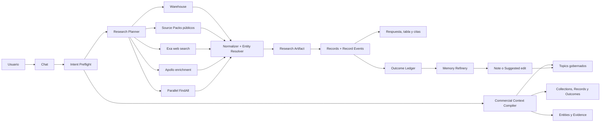

# Driftless Commercial Intelligence Chat — plan de producto e implementación

**Estado:** arquitectura 1.0 en implementación
**Audiencia:** producto, ingeniería, diseño, datos, seguridad y modelo ejecutor  
**Alcance:** convertir el Chat y Radar existentes en una experiencia de inteligencia comercial gobernada, trazable y económicamente sostenible  
**Regla de ejecución:** ninguna fase posterior comienza hasta que el contrato y los criterios de aceptación de la fase anterior estén cumplidos

---

## Nota de arquitectura vigente — MarketIntelligenceGateway 1.0

Esta nota reemplaza las secciones históricas que hacen al API dueño del warehouse o proponen consultas de claims desde el Chat. Se conservan abajo como contexto de decisiones previas, no como guía de implementación.

- `gtm-fabrica` es dueño de adquisición, metadata, resolución de entidad, observaciones, evidencia, recetas, schema e índices.
- Driftless consume exclusivamente tres funciones PostgreSQL versionadas detrás de `MarketIntelligenceGateway`: `discoverCapabilities`, `querySignals` y `getSignalEvidence`.
- El paquete portable `apps/api/contracts/market-intelligence/v1` es la frontera compartida, con schemas, fixtures y checksums. Ningún repo necesita compilar o importar al otro.
- Mastra ejecuta el camino determinista catálogo → señales → evidencia. El Agent interpreta la intención y propone el ángulo comercial; no inventa hechos ni consulta tablas.
- El Chat muestra organización + qué pasó + por qué ahora + ángulo y fuentes. No muestra filas, claims, proveedores, contactos ni jerga del motor.
- Las señales son gratuitas por defecto. Búsqueda pagada conserva cotización y aprobación explícita. Contactos/enrichment son otra capacidad opt-in y no existen todavía en este gateway.
- Los proveedores futuros —web search, terceros o enrichment— se conectan detrás de puertos de capacidad; jamás cambian el contrato de señales ni aparecen como la fuente de un dato.

El primer slice de datos es `public_procurement_new_tender`. Cualquier ampliación publica primero metadata y una capability versionada; luego implementa la receta y finalmente queda disponible al agente.

---

## 1. Resultado que debe producir el sistema

Driftless debe responder una petición como:

> “Dame 25 fabricantes de muebles de Jalisco que probablemente estén creciendo, explícame por qué encajan con nosotros y dime a quién contactar.”

con una experiencia unificada que:

1. Entienda qué vende la empresa, a quién, por qué gana, qué no quiere y qué capacidad comercial tiene.
2. Separe hechos aprobados, hipótesis, contexto operativo y evidencia externa.
3. Consulte primero los datos propios y el warehouse global que ya existen.
4. Use fuentes públicas determinísticas cuando cubran el pedido.
5. Compre búsqueda o enriquecimiento solamente para cubrir huecos concretos.
6. Explique por qué cada cuenta encaja, qué evidencia lo respalda, qué falta y cuánto costó obtenerla.
7. Entregue las cuentas como Records deduplicados y vinculados a una Entity, no como texto efímero.
8. Siga el resultado real: aceptado, descartado, contactado, reunión, oportunidad, ganado o perdido.
9. Proponga aprendizajes sobre el ICP o la estrategia, pero nunca cambie Knowledge silenciosamente.

La unidad de valor no es una búsqueda, un mensaje ni una lista de leads. Es un **resultado comercial verificable con cadena causal completa**.

### North star

`resultados_comerciales_verificados / workspace_activo / mes`

Un resultado verificado requiere:

- una Entity identificada;
- un Research Contract y su versión;
- evidencia con origen y frescura;
- una recomendación o acción;
- una decisión o resultado observable;
- atribución suficiente para reconstruir el camino.

### Promesa de producto

> Driftless convierte la realidad de una empresa en decisiones comerciales gobernadas, respaldadas por evidencia y mejoradas por resultados reales.

No posicionar el producto como “otro buscador de leads”. La búsqueda es el primer caso de uso; la ventaja defensible es la memoria gobernada y el aprendizaje causal.

---

## 2. Decisiones de arquitectura que no quedan abiertas al modelo ejecutor

1. **Un solo Chat y un solo AgentRuntime.** Radar no crea una segunda experiencia conversacional ni un runtime paralelo.
2. **Warehouse-first.** Toda intención de descubrimiento comercial ejecuta un preflight determinístico contra el warehouse antes de cotizar un proveedor pagado.
3. **Proveedor no es fuente.** Exa, Parallel y Apollo son capacidades intercambiables; DENUE, SAT, IIEG, sitios corporativos y documentos son fuentes con licencia, frescura y evidencia propias.
4. **No existe un `CommercialProfile` gigante como segunda fuente de verdad.** El perfil es una proyección compilada desde Topics atómicos, Collections, Records, Entities y evidencia.
5. **No se embebe todo el workspace en cada turno.** Se compila un bundle pequeño, versionado, justificable y relevante a la intención.
6. **Embeddings son opcionales para recuperación, nunca para autoridad.** No determinan permisos, confianza ni capacidad de mutar datos.
7. **No hay cache.** El bundle se compila con consultas directas a Postgres; el run guarda los pins mínimos de auditoría, no una cache reutilizable.
8. **Records siguen siendo la unidad operativa.** No se inventa una segunda tabla genérica de leads.
9. **`record_events` es la base del Outcome Ledger.** Se extiende; no se duplica con otro ledger genérico.
10. **Entity es la identidad cross-collection.** La deduplicación deja de depender de escanear JSONB en una sola Collection.
11. **Knowledge no se reescribe automáticamente.** El sistema produce Notes o Suggested edits; proposer y approver permanecen separados.
12. **Precio antes de gasto.** Toda ruta pagada presenta estimado y pide aprobación explícita o usa un budget cap ya aprobado.
13. **Parallel es el último escalón.** Se reserva para descubrimiento exhaustivo o multi-criterio difícil. Exa se usa para búsqueda y evidencia web; Apollo, para resolver o enriquecer una entidad ya identificada.
14. **Los proveedores permanecen detrás del lenguaje de producto.** La UI habla de “datos propios”, “fuentes públicas”, “web” y “enriquecimiento”; muestra el origen concreto en evidencia, no como arquitectura expuesta.
15. **Mismo modelo conceptual para pyme y corporativo; distinta profundidad.** La primera entrega es workspace-level. La jerarquía empresarial no se simula con metadata sin permisos reales.

---

## 3. Estado actual y brechas verificadas

### 3.1 Activos que se deben conservar

| Activo existente | Valor que ya aporta | Decisión |
|---|---|---|
| `ResearchContract` | Contrato provider-neutral con oferta, comprador, geografía, predicados, exclusiones y output | Evolucionar de forma versionada; no reemplazar |
| `DiscoveryProviderPort` | Aísla los tipos de Parallel del dominio | Mantener para proveedores de descubrimiento exhaustivo |
| GTM warehouse | Entities globales, artifacts, observations, evidence claims, source packs, freshness y contradicciones | Convertirlo en primera ruta real del Chat |
| Source Pack registry | Lifecycle y cost policy por fuente | Usarlo como catálogo de capacidades/fuentes |
| Radar runs | Snapshot del criterio, estados, gasto, intentos y reconciliación | Generalizar la planeación sin romper el run ledger |
| Collections y Records | Esquemas dinámicos, criterio, provenance y work state | Seguir entregando resultados aquí |
| `record_events` | Historial append-only con actor, run y criterio | Extender como Outcome Ledger |
| Entity | Identidad cross-collection | Convertirla en dedup canónico del workspace |
| Context deliveries | Pin de Topic/version entregado | Añadir entrega de contexto comercial |
| Agent runs | Traza, tokens, tools y contexto coincidente | Pin del `CommercialContextBundle` y plan de adquisición |
| Chat/Radar UI | Streaming, tool activity, citas, panel de leads y panel de warehouse | Unificar los paneles y hacer visible la lógica, no el proveedor |

### 3.2 Brechas que explican la experiencia actual

| Brecha | Efecto visible | Corrección |
|---|---|---|
| Warehouse y Parallel son carriles separados | El Chat dice que hay datos, pero luego inicia otra búsqueda | Preflight + Research Planner único |
| Tool selection depende demasiado del modelo | Mezcla fuentes y capacidades sin una política estable | Router determinístico antes del LLM |
| `perfil-comercial` guarda sólo buyer/geografía/exclusiones | Personalización superficial | Topics comerciales atómicos + compiler |
| El perfil puede actualizar un Topic gobernado directamente | Riesgo de cambiar verdad sin aprobación | Note/Suggested edit obligatorio |
| Historial fijo de 12 mensajes | Pierde estrategia, decisiones y causalidad | Bundle externo al historial + compactación de conversación |
| Warehouse tool filtra poco | No puede resolver un Research Contract real | Query contract con predicados, evidencia y paginación |
| Dedup hace scan JS de hasta 500 Records | Duplicados y degradación al crecer | Entity + índices + upsert transaccional |
| Radar no pasa siempre `agentWrite.runId` a Records | La causalidad queda indirecta | Propagar actor/run/correlation en toda escritura |
| Evidencia se guarda como string JSON | Difícil de consultar, validar y citar | Referencias estructuradas a claims/artifacts |
| Citations no incluyen evidence claim/run/bundle | Respuesta comercial poco auditable | Nuevos tipos de cita compartidos |
| LeadsPanel y WarehousePanel compiten | La interfaz reproduce la separación técnica | `ResearchArtifactPanel` unificado |
| No existe onboarding comercial | El Chat no conoce la estrategia base | Commercial Setup posterior al aha global |
| No hay outcome mapping canónico | No se aprende qué criterios producen negocio | Outcome policy + outcome events idempotentes |

### 3.3 Condición previa de producto

`product.md` describe todavía una versión anterior centrada en contexto de repositorios. Antes de implementar contratos nuevos, la Fase 0 debe actualizar la narrativa y el milestone vigente para reconocer:

- Topics como memoria gobernada general;
- Collections/Records como estado operativo;
- Entities como identidad compartida;
- Chat como superficie de inteligencia;
- resultados verificados como unidad de valor;
- adquisición y enriquecimiento como capacidades subordinadas.

No se debe iniciar una migración de datos hasta que esa actualización haya sido revisada.

---

## 4. Modelo conceptual canónico

La implementación usará estas ocho capas; cualquier nuevo nombre debe mapear a una de ellas:

1. **Criterion and Intent:** qué busca la empresa y bajo qué reglas.
2. **Planning and Routing:** qué datos hacen falta y cómo obtenerlos.
3. **Acquisition:** consultas al warehouse, Source Packs, web o proveedores.
4. **Evidence and Identity:** hechos, contradicciones, frescura y entidad resuelta.
5. **Signals and Opportunities:** por qué una entidad podría encajar ahora.
6. **Reachability:** dominio, persona, email, teléfono o canal válido.
7. **Activation:** Records, asignación, siguiente acción y ejecución externa.
8. **Outcomes and Learning:** resultado real, atribución y propuesta de aprendizaje.

Transversalmente se conservan:

- gobierno;
- economía;
- frescura;
- observabilidad;
- seguridad y licencia.

### Términos que no se pueden mezclar

| Término | Definición |
|---|---|
| Provider | Servicio técnico que ejecuta una capacidad: Exa, Parallel, Apollo |
| Source | Origen real de la información: DENUE, SAT, sitio de empresa, nota de prensa |
| Source Pack | Contrato versionado que sabe ingerir una familia de fuentes |
| Executor | Adaptador que llama una capacidad externa o job interno |
| Evidence Claim | Afirmación estructurada respaldada por observations/artifacts |
| Entity | Identidad canónica de una persona u organización |
| Opportunity | Entity + señales + encaje + temporalidad + próximo paso |
| Contact Path | Ruta de contacto con procedencia y verificabilidad |
| Outcome Event | Cambio comercial observable ligado a record/run/action |

---

## 5. Arquitectura objetivo



### Responsabilidades nuevas dentro de la jerarquía existente

No crear nuevas libs. La orquestación que cruza Topics, Collections, warehouse y providers vive en el API service layer:

```text
apps/api/src/commercial-context/
├── commercial-context.module.ts
├── commercial-context.service.ts
├── commercial-profile.service.ts
├── commercial-onboarding.service.ts
├── commercial-context.contracts.ts
├── commercial-context.policy.ts
└── dto/

apps/api/src/radar/
├── planning/
│   ├── research-planner.service.ts
│   ├── research-plan.contract.ts
│   ├── acquisition-policy.ts
│   └── acquisition-economics.ts
├── ports/
│   ├── discovery-provider.port.ts          # existente; exhaustive discovery
│   ├── web-search-provider.port.ts         # nuevo; search/fetch/evidence
│   └── entity-enrichment-provider.port.ts  # nuevo; enrich resolved entity
└── adapters/
    ├── exa.adapter.ts
    └── apollo.adapter.ts
```

`libs/db` recibe solamente Entities y migrations. `apps/api` mantiene la lógica y NestJS. Dashboard renderiza contratos; no decide routing ni costos.

---

## 6. Contrato del perfil comercial

### 6.1 Topics atómicos

El onboarding crea o propone Topics separados, todos en el área `InteligenciaComercial`:

| Slug sugerido | Contenido | Confianza inicial |
|---|---|---|
| `oferta-comercial` | Qué se vende, resultado prometido, ticket, ciclo, capacidad | Assumed hasta aprobación |
| `cliente-ideal` | Firmographics, technographics y patrones positivos | Assumed/Knowledge según aprobación |
| `cliente-no-ideal` | Exclusiones y red flags | Assumed/Knowledge |
| `compradores-y-comite` | Roles, dolores, objeciones y autoridad | Assumed |
| `senales-de-compra` | Eventos y condiciones que elevan prioridad | Assumed |
| `geografia-comercial` | Mercados permitidos, prioridades y restricciones | Known/Knowledge |
| `estrategia-comercial` | Canales, capacidad, motion, SLAs y restricciones | Known/Assumed |
| `objetivos-comerciales` | Resultado 30/90 días y métricas | Known, revisable |
| `lenguaje-del-mercado` | Frases, objeciones y palabras usadas en conversaciones | Evidence-backed Note |

Crear un Topic hub liviano `inteligencia-comercial` relacionado con estos spokes. No duplicar sus cuerpos dentro del hub.

### 6.2 Proyección compilada

```ts
interface CommercialProfileProjection {
  schema_version: '1.0'
  workspace_id: string
  scope: CommercialScope
  archetype: 'founder_led_sme' | 'sales_team' | 'enterprise'
  offer: OfferSummary
  positive_fit: PredicateSet
  negative_fit: PredicateSet
  buying_signals: PredicateSet
  buyers: BuyerRole[]
  geography: GeographyPolicy
  operating_constraints: OperatingConstraints
  objectives: CommercialObjective[]
  topic_pins: TopicPin[]
  known: string[]
  assumed: string[]
  missing: string[]
  conflicts: ContextConflict[]
  compiled_at: string
}
```

Esta estructura es una respuesta de servicio; no se persiste como verdad paralela. La persistencia autorizada son los Topics/versiones que la componen.

### 6.3 Scope

```ts
interface CommercialScope {
  workspace_id: string
  business_unit_id?: string
  offer_id?: string
  territory_id?: string
  team_id?: string
  user_id?: string
  thread_id?: string
}
```

Fase inicial:

- sólo `workspace_id`, `user_id` y `thread_id` afectan selección;
- `workspace_id` es la frontera de permisos;
- user/thread pueden agregar preferencias temporales, nunca ampliar permisos;
- business unit, offer, territory y team se reservan hasta implementar RBAC y ownership reales.

### 6.4 Precedencia de contexto

De mayor a menor autoridad:

1. Knowledge aprobado y vigente dentro del scope.
2. Instrucción explícita del usuario en el turno actual.
3. Restricciones aprobadas en Collection/criterion.
4. Records y Outcome Events verificables.
5. Notes recientes y con evidencia.
6. Evidencia externa fresca.
7. Resumen conversacional.
8. Inferencia del modelo.

Una capa inferior no puede contradecir silenciosamente una superior. El compiler registra el conflicto y obliga a mostrarlo o preguntar si cambia materialmente la acción.

---

## 7. Commercial Context Compiler

### 7.1 Entrada y salida

```ts
interface CompileCommercialContextInput {
  workspace_id: string
  principal: PrincipalRef
  thread_id: string
  message_id: string
  intent: CommercialIntent
  collection_id?: string
  record_ids?: string[]
  token_budget: number
}

interface CommercialContextBundle {
  schema_version: '1.0'
  bundle_id: string
  objective: string
  intent: CommercialIntent
  scope: CommercialScope
  profile: CommercialProfileProjection
  topic_pins: TopicPin[]
  operational_refs: OperationalRef[]
  evidence_refs: EvidenceRef[]
  outcome_summary: OutcomeSummary
  assumptions: Assumption[]
  conflicts: ContextConflict[]
  missing_material_context: MissingContext[]
  authority: AuthorityPolicy
  budget: BudgetPolicy
  selection: {
    reason_by_ref: Record<string, string>
    omitted_count: number
    truncation_reason?: string
  }
  compiled_at: string
}
```

### 7.2 Selección determinística

El compiler ejecuta, en orden:

1. Resuelve workspace y principal desde el request autenticado; nunca desde texto del usuario.
2. Clasifica la intención con reglas estables y, si hace falta, clasificación estructurada del modelo.
3. Carga el núcleo comercial aprobado: oferta, ICP, exclusiones, señales, geografía y estrategia.
4. Carga el criterion de la Collection o Radar run involucrado y fija sus versiones.
5. Recupera Records/Entities explícitamente mencionados.
6. Resume resultados recientes relevantes por outcome, sin arrastrar toda la Collection.
7. Recupera Evidence Claims sólo cuando la intención requiere hechos externos.
8. Detecta contradicciones por campo conceptual, confianza, autoridad y frescura.
9. Aplica el token budget: nunca elimina permisos, exclusiones, presupuesto o conflictos materiales.
10. Persiste pins y rationale de auditoría en el `agent_run`; crea `context_deliveries` por Topic entregado.

### 7.3 Presupuesto de contexto por defecto

| Bloque | Cuota inicial | Regla |
|---|---:|---|
| Políticas/autoridad | 10% | Nunca truncar restricciones materiales |
| Perfil comercial | 25% | Compactar por campos, no por recorte ciego |
| Criterion del trabajo | 20% | Pin completo del contrato activo |
| Estado operativo | 20% | Top-N por relevancia/recencia/outcome |
| Evidencia | 15% | Claims, no documentos completos |
| Conversación resumida | 10% | Decisiones y preguntas abiertas |

El valor exacto se configura; el contrato y el orden no.

### 7.4 Compactación conversacional

Reemplazar el límite semánticamente pobre de “12 mensajes” por:

- últimos mensajes suficientes para coherencia local;
- un resumen estructurado con `decisions`, `assumptions`, `open_questions`, `entities`, `promised_actions`;
- pins externos del bundle;
- renovación del resumen cuando cruza un umbral de tokens, sin borrar mensajes originales.

El resumen es memoria de thread, no Knowledge.

### 7.5 Tipos de cita nuevos

Extender el contrato compartido de citations con:

- `evidence_claim`;
- `gtm_artifact`;
- `research_run`;
- `commercial_context_bundle`;
- `record_event`.

Cada cita incluye `id`, label, source family, observed_at/freshness, confidence y URL sólo cuando sea seguro mostrarla.

---

## 8. Research Contract v2

Evolucionar el contrato existente aditivamente:

```ts
interface ResearchContractV2 {
  schema_version: '2.0'
  objective: string
  offer: OfferRef
  buyer: BuyerSpec
  entity_type: 'organization' | 'person'
  geography: GeographySpec
  time_window_days?: number
  predicates: {
    must: ResearchPredicate[]
    should: ResearchPredicate[]
    must_not: ResearchPredicate[]
  }
  output_fields: OutputFieldSpec[]
  reachability: {
    required: boolean
    preferred_channels: Array<'email' | 'phone' | 'linkedin' | 'website'>
  }
  evidence_policy: {
    minimum_sources: number
    source_family_diversity?: number
    maximum_age_days_by_claim: Record<string, number>
    allow_inference: boolean
  }
  economics: {
    maximum_total_cost_usd: number
    require_quote_above_usd: number
    maximum_cost_per_accepted_entity_usd?: number
  }
  delivery: {
    collection_id: string
    target_count: number
    review_overflow_count: number
  }
  context_pins: TopicPin[]
}
```

Reglas:

- el run guarda el snapshot inmutable;
- nunca relee “lo último” durante una ejecución ya aprobada;
- un cambio de criterio produce nueva versión/run, no mutación retroactiva;
- predicates se normalizan a vocabulario canónico, pero se conserva el texto original del usuario;
- geografía distingue país, estado, municipio, radio y ubicación textual;
- outputs separan `required`, `desired` y `display_only`.

---

## 9. Research Planner y política multi-source

### 9.1 Research Plan

```ts
interface ResearchPlan {
  plan_id: string
  contract_version: string
  stages: ResearchPlanStage[]
  coverage_estimate: number
  estimated_cost_usd: number
  estimated_latency_ms: { p50: number; p95: number }
  paid_approval_required: boolean
  stop_conditions: StopCondition[]
  fallback_conditions: FallbackCondition[]
}

interface ResearchPlanStage {
  ordinal: number
  capability: 'warehouse_query' | 'source_pack' | 'web_search' | 'entity_enrichment' | 'exhaustive_discovery'
  source_families: string[]
  provider_candidates: string[]
  required_inputs: string[]
  expected_new_fields: string[]
  expected_marginal_coverage: number
  maximum_stage_cost_usd: number
}
```

### 9.2 Cómo compilar intención contra múltiples fuentes

El Chat no selecciona Source Packs buscando palabras como “medicina” o “COFEPRIS” dentro del mensaje. Primero transforma la petición en **requisitos de afirmación** y después pregunta al catálogo qué capacidades pueden aportar evidencia para cada requisito.

```ts
interface ClaimRequirement {
  id: string
  subject_kind: 'legal_entity' | 'facility' | 'product' | 'license' | 'person' | 'event'
  claim_type: string
  operator: 'eq' | 'in' | 'contains' | 'exists' | 'gte' | 'lte' | 'within'
  value?: unknown
  geography?: GeographySpec
  temporal_policy?: {
    as_of?: string
    maximum_age_days?: number
    require_current_status?: boolean
  }
  evidence_class?: Array<
    'official_registry' | 'official_dataset' | 'direct_primary_source' |
    'commercial_dataset' | 'web_document' | 'provider_index' | 'inference'
  >
  strictness: 'required' | 'desired' | 'disqualifier'
  ambiguity?: {
    alternatives: string[]
    material: boolean
  }
}

interface IntentCompilation {
  original_request: string
  universe: ClaimRequirement[]
  qualification: ClaimRequirement[]
  reachability: ClaimRequirement[]
  forbidden_conclusions: string[]
  interpretations: Array<{
    id: string
    label: string
    requirements: ClaimRequirement[]
  }>
  clarification?: {
    question: string
    changes_plan_materially: boolean
  }
}
```

La compilación usa el vocabulario canónico del sistema y conserva el texto original. El LLM puede proponer el parse estructurado; un validador determinístico rechaza tipos, operadores o conclusiones fuera del contrato.

#### Ejemplo: “empresas dadas de alta en medicina”

“Dadas de alta” es una ambigüedad material. Puede significar:

1. unidades económicas cuya actividad declarada pertenece a servicios médicos;
2. establecimientos con licencia/autorización sanitaria;
3. titulares de un registro sanitario de medicamento o dispositivo;
4. organizaciones asociadas a un ensayo clínico autorizado;
5. empresas fiscalmente activas cuyo giro declarado se relaciona con salud.

El Chat debe preguntar una sola cosa:

> “¿Buscas negocios cuya actividad es médica, establecimientos autorizados por COFEPRIS, titulares de productos registrados, o la intersección?”

Si el usuario contesta “ambas”, el planner construye dos requisitos distintos y los intersecta después de resolver identidades:

- DENUE aporta evidencia de una **unidad económica observada con actividad declarada** en un corte.
- COFEPRIS aporta evidencia de una **autorización, licencia, ensayo o registro sanitario específico**, según el padrón consultado.
- Ninguna aparición en DENUE demuestra autorización sanitaria.
- Ningún registro COFEPRIS demuestra por sí solo que el establecimiento opere actualmente o que toda la entidad legal pertenezca al universo solicitado.
- “No apareció” significa `unknown/not_observed`, no `false`, salvo que la fuente sea exhaustiva para el scope y corte declarados.

La intersección no se hace por igualdad ingenua de nombre. Debe resolver explícitamente:

`producto/registro → titular legal → empresa → establecimiento → unidad DENUE`

y conservar confidence y obstrucciones cuando faltan RFC, dominio, dirección o relación de titularidad.

### 9.3 Source Capability Manifest

Cada Source Pack declara semántica positiva y negativa. “Trae un campo industria” es insuficiente.

```ts
interface SourceCapabilityManifest {
  slug: string
  version: number
  source_family: string
  lifecycle: 'experimental' | 'shadow' | 'active' | 'degraded' | 'deprecated'
  verbs: Array<'harvest' | 'resolve'>
  subject_kinds: ClaimRequirement['subject_kind'][]
  observations: Array<{
    claim_type: string
    claim_scope: 'entity' | 'facility' | 'product' | 'license' | 'event'
    evidence_class: ClaimRequirement['evidence_class'][number]
    authority: 'primary_official' | 'primary_private' | 'secondary' | 'index'
    geography_coverage: string[]
    temporal_semantics: string
    exhaustive_within_scope: boolean
    join_keys: string[]
  }>
  cannot_establish: string[]
  known_false_positive_patterns: string[]
  freshness: {
    cadence: string
    stale_after_days: number
  }
  access: {
    method: 'download' | 'api' | 'http' | 'browser' | 'provider'
    live_lookup_supported: boolean
  }
  license_policy_ref: string
  cost_policy_ref: string
  health_status: string
}
```

Ejemplo conceptual:

| Pack | Puede aportar observación sobre | No permite concluir |
|---|---|---|
| DENUE | actividad declarada, unidad, ubicación, tamaño/corte disponible | autorización sanitaria, existencia legal actual garantizada, intención de compra |
| COFEPRIS registros | registro/autorización, titular, producto y estado según padrón | operación actual, fit comercial, universo total de empresas médicas |
| SAT padrón sectorial | folio/RFC/sector/fecha según publicación | razón social cuando el documento no la contiene, exportación efectiva posterior |
| Directorio privado | pertenencia declarada a categoría y datos de perfil | licencia, exhaustividad, vigencia legal |
| Web/prensa | afirmación publicada y señales recientes | estatus oficial cuando requiere registro público |

El manifest dice qué **observaciones** aporta; una Signal Recipe determina qué assertion puede inferirse y con qué límites. Una fuente nunca se eleva directamente a verdad canónica.

### 9.4 Signal Recipes: la frontera entre dato e inferencia

```ts
interface SignalRecipe {
  slug: string
  version: number
  input_claim_types: string[]
  required_source_families: number
  independence_policy: string
  negative_checks: string[]
  allowed_assertions: string[]
  forbidden_conclusions: string[]
  state_machine?: Record<string, unknown>
  freshness_policy: Record<string, number>
  eval_pack_ref: string
}
```

Separación obligatoria:

- Source Pack adquiere y normaliza Observations.
- Signal Recipe interpreta Observations y produce Event Assertions/States.
- Commercial Mapping evalúa relevancia para la oferta/ICP.
- Opportunity Flow compone adquisición, identidad, signal, fit, reachability y stopping.

Así, “tiene registro sanitario” y “es buen prospecto ahora” nunca son el mismo cálculo. Se reportan por separado `event_confidence`, `commercial_fit` y `contact_readiness`.

### 9.5 Algoritmo del Source Planner

1. **Compile:** parsear universo, subjects, claims, tiempo, geografía, evidencia y ambigüedades.
2. **Clarify:** preguntar sólo si una ambigüedad cambia la afirmación o el plan materialmente.
3. **Match:** filtrar manifests activos por claim type, subject, geografía, licencia, frescura y evidence class.
4. **Cover:** calcular un set cover ponderado que cubra todos los requisitos obligatorios al menor costo/latencia y con la independencia requerida.
5. **Order:** respetar dependencias; por ejemplo, descubrir entidades antes de resolver contactos.
6. **Probe:** ejecutar muestras pequeñas y baratas para medir yield, novedad y joinability.
7. **Acquire:** expandir sólo rutas útiles. Rutas independientes pueden correr en paralelo dentro del mismo budget; no “todas las fuentes en paralelo” por default.
8. **Normalize:** producir Observations sin concluir todavía.
9. **Resolve:** unir legal entity, facility, asset, product y personas sin false merges.
10. **Interpret:** aplicar Recipes, negative checks, freshness e independencia de familias.
11. **Qualify:** aplicar Commercial Mapping/ICP después de establecer el estado factual.
12. **Stop:** detener cuando el valor marginal, target, presupuesto o confidence policy lo indiquen.

Pseudo-contrato del matcher:

```ts
interface CapabilityMatch {
  requirement_id: string
  source_pack_slug: string
  supported: boolean
  coverage_reason: string
  limitations: string[]
  expected_join_keys: string[]
  expected_cost_usd: number
  expected_latency_ms: number
  freshness_status: 'fresh' | 'stale' | 'unknown'
}
```

Hard constraints se aplican antes del score: licencia, autoridad requerida, scope, presupuesto y freshness. Después se optimiza cobertura marginal.

### 9.6 Cuando no existe una fuente capaz

El sistema no improvisa que una búsqueda web equivale a un registro oficial:

1. responde la parte cubierta;
2. marca el claim faltante como `unknown`;
3. puede usar Exa para localizar una fuente candidata o evidencia secundaria, etiquetada como tal;
4. registra un coverage gap/obstruction;
5. lo envía al backlog de la Fábrica de Fuentes;
6. el agente Explorador puede proponer Source Pack + contrato + fixtures vía PR;
7. humano aprueba; el pack pasa experimental → shadow → active.

La petición interactiva nunca autoriza al agente a fabricar y activar un scraper dinámico en producción.

### 9.7 Orden de ejecución obligatorio

1. **Warehouse:** datos ya adquiridos; costo marginal cero para el usuario.
2. **Source Packs determinísticos:** DENUE, IIEG, SAT u otra fuente con contrato y licencia aprobada.
3. **Exa search/fetch:** descubrir páginas o llenar evidencia web faltante.
4. **Apollo:** enriquecer una organización/persona ya resuelta, principalmente reachability y atributos comerciales.
5. **Parallel FindAll:** búsqueda exhaustiva multi-criterio cuando las rutas anteriores no alcanzan la cobertura solicitada.

Excepciones permitidas:

- el usuario pide explícitamente una fuente;
- la política de frescura invalida warehouse/source pack;
- una fuente no permite el uso solicitado por licencia;
- el deadline aprobado justifica saltar una ruta lenta;
- un preview demuestra que la ruta barata no cubre el criterio.

Toda excepción se registra como `routing_reason`.

### 9.8 Ejemplo con múltiples fuentes

Solicitud: “Exportadores de aguacate de Michoacán con señales recientes de expansión.”

1. Warehouse identifica organizaciones por actividad/geografía y conserva evidencia DENUE/IIEG.
2. Un Source Pack de exportadores o padrón autorizado aporta la condición exportadora.
3. Exa busca evidencia reciente de expansión sólo para las entidades candidatas, con queries por nombre/dominio.
4. Entity Resolver fusiona aliases/dominios y registra contradicciones.
5. Apollo se ejecuta sólo sobre las entidades aceptables sin contacto suficiente.
6. Parallel se cotiza únicamente si faltan entidades para el target y el usuario necesita exhaustividad.

El resultado no dice “mezclé Parallel con DENUE”. Dice:

- “18 cuentas provienen de datos públicos ya disponibles.”
- “7 se confirmaron con evidencia web reciente.”
- “12 tienen contacto enriquecido.”
- cada claim muestra su fuente concreta.

### 9.9 Score del planner

Cada etapa candidata se ordena por:

`marginal_value = expected_new_qualified_entities × confidence × freshness × license_factor / (cost + latency_penalty)`

Este score ayuda a ordenar; no reemplaza hard constraints de licencia, presupuesto, exclusión, tenant o aprobación.

### 9.10 Cost policy

- Costos y límites viven en `gtm_source_packs.cost_policy` o configuración validada.
- No hardcodear precios de proveedores en feature logic, prompts ni UI.
- Guardar `quoted_cost`, `actual_cost`, unidad, versión de tarifa y uso medido.
- El quote muestra rango, qué etapa lo genera y qué ocurrirá si se agota el cap.
- Overrun prohibido: la ejecución se detiene antes de exceder el cap.
- Los precios externos de este documento son referencia de investigación, no contrato runtime.

---

## 10. Proveedores y contratos de capacidad

### 10.1 Exa

Usar para:

- búsqueda web focalizada;
- encontrar sitios corporativos, páginas de producto, noticias y documentos;
- recuperar texto/highlights para Evidence Claims;
- grounding de afirmaciones recientes.

No usar para:

- actuar como CRM;
- reemplazar identidad canónica;
- decidir fit por sí solo;
- enriquecer masivamente contactos si ya existe un proveedor específico.

```ts
interface WebSearchProviderPort {
  search(input: WebSearchInput): Promise<WebSearchResult>
  fetch(input: WebFetchInput): Promise<WebDocument>
  estimate(input: WebSearchInput): Promise<ProviderQuote>
}
```

El adapter convierte resultados a Artifacts/Observations/Claims antes de que lleguen a Chat.

### 10.2 Apollo

Usar después de resolver una Entity o dominio:

- organización por domain/website/LinkedIn/name;
- headcount, industry, revenue/funding cuando el plan contratado lo permita;
- personas/contact paths y validación comercial;
- batch pequeño y deduplicado.

```ts
interface EntityEnrichmentProviderPort {
  enrichOrganization(input: ResolvedOrganizationInput): Promise<EnrichmentResult>
  enrichPeople(input: ResolvedPeopleInput): Promise<EnrichmentResult>
  estimate(input: EnrichmentEstimateInput): Promise<ProviderQuote>
}
```

No enviar una entidad a Apollo si los campos requeridos ya están frescos y suficientemente confiables.

### 10.3 Parallel

Conservar `DiscoveryProviderPort` para:

- descubrimiento exhaustivo;
- conjuntos definidos por varias condiciones difíciles;
- runs paginados/streaming con cuota explícita;
- preview pequeño antes de comprar una ejecución mayor.

Política:

- nunca es el default de “buscar en internet”;
- no se usa para enrichment rutinario;
- preview de aproximadamente 10 candidatos antes de una corrida cara cuando la API lo soporte;
- aprobación explícita por quote;
- stop si la cobertura incremental observada cae bajo el umbral.

### 10.4 Nuevo proveedor futuro

Para incorporar otro proveedor:

1. Declarar qué capacidad implementa, no crear vocabulario de dominio nuevo.
2. Añadir adapter con traducción de request/response.
3. Registrar cost, rate limits, licencia, regiones, fields y freshness.
4. Añadir fixtures contractuales y tests de resiliencia.
5. Ejecutar lifecycle `experimental → shadow → active`.
6. Comparar valor marginal contra rutas activas.
7. No exponer el provider en prompts de negocio ni hacer branching disperso por nombre.

---

## 11. Evidencia, identidad y deduplicación

### 11.1 Causalidad mínima por lead

Cada Record creado por research debe poder reconstruir:

```text
commercial_context_bundle
  → research_contract_version
  → research_plan
  → provider/source attempts
  → evidence claims
  → resolved entity
  → record creation/update event
  → human decision
  → action/correlation
  → external outcome
  → learning proposal
```

### 11.2 Corrección inmediata del Entity bridge

La migración `1715200000130-AddEntitiesGtmLink.ts` añadió la relación con GTM, pero `libs/db/src/entities/entity.entity.ts` debe declarar:

- `linked_gtm_entity_id: string | null`;
- `gtm_link_confidence: number | null` o el tipo exacto existente en la migración;
- `gtm_linked_at: Date | null`.

Primero verificar nombres/tipos reales en la migración. No crear columnas duplicadas.

### 11.3 Algoritmo de resolución

1. Normalizar dominio registrable cuando existe.
2. Buscar Entity workspace por `(workspace_id, kind, dedup_key)`.
3. Buscar `linked_gtm_entity_id` cuando el resultado proviene del warehouse.
4. Comparar aliases, nombre legal, geografía y identifiers de fuentes.
5. Si score supera umbral alto, vincular automáticamente y registrar método/confianza.
6. En zona gris, crear candidate link para revisión; no fusionar.
7. En contradicción fuerte, conservar ambas entidades y obstruction/contradiction.
8. Hacer upsert y Record linkage en transacción corta.

Eliminar el fallback que carga hasta 500 Records y compara keys en JavaScript.

### 11.4 Evidencia estructurada en Records

No seguir escribiendo `evidencia` como string JSON. El schema comercial debe aceptar un campo estructurado versionado:

```ts
interface RecordEvidenceRef {
  claim_id: string
  claim_type: string
  display_value?: string
  confidence: number
  observed_at?: string
  source_families: string[]
}
```

Durante migración:

- reader soporta formato string legacy y refs nuevas;
- writer sólo produce refs nuevas;
- backfill convierte únicamente strings válidos;
- valores corruptos se marcan para revisión, no se descartan;
- después del periodo de compatibilidad se elimina el reader legacy.

---

## 12. Outcome Ledger

### 12.1 Extender, no duplicar

`record_events` ya es append-only y tiene workspace, record, actor, run, correlation y criterion pins. Extenderlo con:

- `event_type = 'outcome'`;
- `occurred_at timestamptz` separado de `created_at`;
- `idempotency_key text nullable`;
- `source_event_id text nullable` para webhooks/imports;
- `cause_refs jsonb` acotado: agent run, radar run, broker execution, prior event;
- `evidence_refs jsonb` acotado;
- índice único parcial `(workspace_id, idempotency_key) WHERE idempotency_key IS NOT NULL`.

No poner contenido completo de emails, llamadas o reuniones en `detail`; guardar referencias y atributos mínimos.

### 12.2 Outcome policy por Collection

Añadir a `Collection`:

```ts
interface OutcomePolicy {
  schema_version: '1.0'
  stage_mapping: Record<string, CanonicalOutcomeKind>
  success_kinds: CanonicalOutcomeKind[]
  failure_kinds: CanonicalOutcomeKind[]
  attribution_window_days: number
  require_human_verification_for: CanonicalOutcomeKind[]
}

type CanonicalOutcomeKind =
  | 'accepted'
  | 'rejected'
  | 'contacted'
  | 'replied'
  | 'meeting_booked'
  | 'opportunity_created'
  | 'won'
  | 'lost'
  | 'disqualified'
```

Cada pipeline mantiene sus nombres de stages; el mapping permite analítica comparable sin imponer un workflow global.

### 12.3 Aprendizaje

El Memory Refinery observa lotes suficientes, por ejemplo:

- “Empresas con señal X aceptadas 3.2× más que el promedio.”
- “El predicado Y genera revisión pero ninguna reunión.”
- “Este sector contradice el ICP aprobado.”

Produce:

1. candidate claim con muestra, ventana y límites;
2. comparación con Topics vigentes;
3. Note nueva o Suggested edit si toca Knowledge;
4. revisión humana.

Nunca convierte correlación en regla sin evidencia ni reescribe el ICP automáticamente.

---

## 13. Workflow conversacional del nuevo Chat

### 13.1 Flujo normal de descubrimiento

1. Usuario pide cuentas, señales, contactos o análisis.
2. `IntentPreflight` detecta `research.discovery` y extrae target/count/geografía sin gastar.
3. Compiler carga el contexto comercial y muestra una línea discreta: “Usando ICP v4 · México · excluir gobierno”.
4. Chat construye Research Contract v2 desde la petición + contexto.
5. Si falta algo material, hace **una** pregunta. Si no, declara supuestos y continúa.
6. Planner consulta warehouse y calcula coverage.
7. Chat entrega resultados gratuitos iniciales o dice exactamente qué falta.
8. Planner propone etapas adicionales con quote.
9. Usuario aprueba gasto o reduce alcance.
10. Run ejecuta, transmite progreso por etapa y actualiza un solo Research Artifact.
11. Normalizer resuelve Entity, evidence y fit.
12. Sólo matches/review válidos llegan a Records; basura queda en la traza.
13. Chat explica resumen, limitaciones, costo real y próximos pasos.
14. Usuario acepta/descarta/asigna; todo queda en Record Events.

### 13.2 Regla de preguntas

Preguntar sólo si la respuesta cambia al menos uno de:

- hard filter;
- fuente legalmente usable;
- presupuesto;
- target count;
- geografía;
- tipo de entidad;
- necesidad de contacto;
- criterio de aceptación.

No preguntar por preferencias que puedan asumirse y mostrarse como supuestos editables.

### 13.3 Flujo de análisis, no búsqueda

Para “¿qué aprendimos de los leads del trimestre?”:

1. Compiler carga criterio, Records y Outcome Ledger.
2. Planner no invoca adquisición externa salvo que se pida comparar con mercado.
3. El modelo calcula cohortes sobre consultas agregadas, no leyendo 500 Records en prompt.
4. Respuesta separa hechos, inferencias y recomendaciones.
5. Cada recomendación cita outcomes y versiones de criterio.

### 13.4 Flujo de acción

Para “contacta a los 10 aceptados”:

1. Recuperar Collection + criterion.
2. Validar broker operations disponibles.
3. Si falta la operación, detenerse y reportar la capacidad ausente; no crear scripts.
4. Confirmar selección, canal, template y presupuesto/autoridad.
5. Ejecutar operaciones auditadas.
6. Escribir `action` events con correlation id.
7. Ingerir respuestas posteriores como `outcome` idempotente.

---

## 14. Onboarding comercial

### 14.1 Lugar en el producto

El onboarding global actual conserva su objetivo: workspace, superficie, agente y primera Note. El **Commercial Setup** comienza después de esa activación o al primer pedido comercial. Es opcional, reanudable y usable desde Chat.

### 14.2 Primera experiencia

Objetivo del aha:

> “Driftless encontró una oportunidad y pudo explicar por qué encaja específicamente con mi empresa.”

No pedir veinte campos antes de mostrar valor.

### 14.3 Secuencia

1. **Entrada:** “Cuéntame qué vendes o comparte tu sitio/deck.”
2. **Oferta:** resultado comprado, ticket/rango, ciclo y capacidad.
3. **Clientes:** dos mejores clientes y por qué; uno malo y por qué.
4. **Compradores:** usuario, campeón, decisor, procurement y objeciones.
5. **Señales:** eventos que vuelven urgente el problema.
6. **Mercado:** geografía, sectores, tamaños y exclusiones.
7. **Motion:** inbound/outbound/partners/founder-led, volumen y restricciones.
8. **Objetivo:** resultado 30 y 90 días.
9. **Company Map:** Known / Assumed / Missing / Contradictory.
10. **Aprobación:** crear/proponer Topics atómicos.
11. **Calibración:** mostrar 5 cuentas del warehouse o una muestra gratuita y pedir aceptar/descartar con motivo.
12. **Cierre:** ajustar predicados como Note, no Knowledge automática.

### 14.4 Importaciones opcionales

- sitio web;
- deck comercial;
- notas o transcripciones de reuniones;
- CRM conectado;
- chats y documentos en ConnectorDocuments;
- Collections existentes.

Cada importación conserva provenance y no se trata como verdad aprobada. El usuario ve qué fue inferido.

### 14.5 Estado del onboarding

Crear sidecar de workflow, no una nueva primitiva de negocio:

`commercial_setup_sessions`

| Columna | Propósito |
|---|---|
| `id uuid` | identidad |
| `workspace_id uuid` | tenant explícito |
| `started_by text` | usuario |
| `status text` | draft/completed/abandoned |
| `archetype text` | founder-led/sales-team/enterprise |
| `step text` | reanudación |
| `draft jsonb` | respuestas e inferencias no aprobadas |
| `source_refs jsonb` | documentos/records usados |
| `created_at/updated_at/completed_at` | lifecycle |

Índices: `(workspace_id, status, updated_at DESC)` y único parcial de sesión draft activa por workspace/usuario. Mantener la tabla server-only; no exponerla al Data API.

### 14.6 Pyme vs corporativo

| Dimensión | Pyme / founder-led | Corporativo |
|---|---|---|
| Entrevista | 8–12 minutos, ejemplos concretos | Import guiado + workshops por unidad |
| Scope inicial | Una oferta/mercado principal | Unidad, oferta, territorio y equipo |
| Aprobación | Founder/admin | Owner por área + governance |
| Métrica inmediata | Reuniones calificadas | Pipeline, cobertura, eficiencia y compliance |
| Contexto operativo | Chats, reuniones, pipeline ligero | CRM, enablement, call intelligence, BI |
| UX | Defaults fuertes, poco setup | Scope visible, conflictos y auditoría |

Construir primero la experiencia pyme/founder-led en México; diseñar los contratos para scope futuro sin fingir RBAC empresarial.

---

## 15. Experiencia de usuario del Chat

### 15.1 Superficie principal

En cada turno comercial mostrar un pill discreto:

`Usando: ICP v4 · Manufactura · México · 3 restricciones`

Click abre un drawer con:

- Known;
- Assumed;
- Missing;
- Conflicts;
- Topics/versiones;
- sources seleccionadas para la próxima ejecución;
- “Proponer cambio”, nunca “editar Knowledge” directo.

### 15.2 Research Artifact unificado

Reemplazar la exclusión mutua de `WarehousePanel` y `LeadsPanel` por un solo `ResearchArtifactPanel`.

Estados:

- planning;
- warehouse_results;
- awaiting_quote;
- acquiring;
- normalizing;
- completed;
- partial;
- failed.

Columnas base:

- Cuenta;
- por qué encaja;
- por qué ahora;
- confianza;
- cobertura del criterio;
- origen/evidencia;
- frescura;
- contacto disponible;
- estado;
- siguiente acción.

El panel debe transmitir resultados progresivos sin cambiar de objeto visual al cambiar de fuente.

### 15.3 Copy

Correcto:

- “Encontré 14 cuentas en datos ya disponibles.”
- “Para validar crecimiento reciente de 9 cuentas necesito revisar la web; costo estimado…”
- “No encontré evidencia suficiente para afirmar X.”

Incorrecto:

- “Llamaré Parallel porque tiene la capability FindAll.”
- “Mezclé DENUE y Exa.”
- “Estos son leads calificados” sin distinguir inferencia de decisión humana.

### 15.4 Rendimiento percibido

- primer token narrativo rápido después del preflight;
- warehouse preview antes de proveedor pagado;
- progreso por etapa, no spinner genérico;
- filas incrementales y conteo estable;
- cancelación que detiene nuevas etapas y conserva resultados ya adquiridos;
- retry por etapa idempotente, no reinicio completo.

### 15.5 Accesibilidad y estados

- teclado y focus management en drawer/panel;
- `aria-live` moderado para progreso;
- tabla usable sin color como única señal;
- loading, vacío, partial, degraded y error con copy específico;
- citas accesibles y copiables;
- responsive con drawer bottom-sheet en pantallas pequeñas.

---

## 16. Cambios de datos y migraciones

### 16.1 Migraciones propuestas

No fijar número hasta rebasear con `libs/db/src/migrations` vigente.

1. `AlignEntityGtmBridgeEntity` — si sólo es drift ORM, no DDL adicional.
2. `AddCommercialSetupSessions`.
3. `AddCollectionOutcomePolicy`.
4. `ExtendRecordEventsForOutcomes`.
5. `AddResearchCausalLinks` — sólo si el audit confirma que pins/plan no caben versionadamente en `agent_runs`/`radar_runs` existentes.
6. `ExtendContextDeliverySources` para `chat_context` y `commercial_context`.
7. Índices para research/dedup/evidence después de `EXPLAIN (ANALYZE, BUFFERS)` en staging.

### 16.2 Índices mínimos a verificar

- `entities(workspace_id, kind, dedup_key)` único parcial donde dedup_key no es null — existente o equivalente.
- `entities(linked_gtm_entity_id)` parcial donde no es null.
- `records(workspace_id, entity_id)` parcial donde entity_id no es null.
- `record_events(workspace_id, record_id, created_at DESC)`.
- `record_events(workspace_id, event_type, occurred_at DESC)` para outcomes.
- único parcial de idempotency.
- `context_deliveries(workspace_id, source, created_at DESC)`.
- índices de warehouse por claim type/entity/observed_at y expresiones JSONB sólo para filtros reales y medidos.

No añadir GIN general a todo JSONB. Preferir índices pequeños y específicos para queries observadas.

### 16.3 Política Postgres/Supabase

- Toda tabla de workspace incluye `workspace_id` explícito.
- API filtra tenant de forma ineludible y conserva WorkspaceGuard global.
- Si una tabla está en schema expuesto, habilitar RLS y políticas antes de release.
- Grants y RLS se revisan por separado.
- Views analíticas usan `security_invoker = true` o viven en schema server-only.
- Nuevas tablas no se exponen al Data API por defecto.
- Transacciones cortas; no mantener locks mientras se llama un proveedor.
- Provider call sigue patrón write-ahead → external call → reconciliation.
- FKs reciben índice cuando participen en joins/deletes.
- Backfills por lotes con checkpoint; nunca una transacción gigante.

### 16.4 Migración expand/contract

1. Expandir schema nullable/aditivo.
2. Deploy reader compatible con legacy+nuevo.
3. Deploy writer nuevo con causal links.
4. Backfill por lotes e instrumentar errores.
5. Comparar dual reads en shadow.
6. Hacer cutover de lectura.
7. Mantener ventana de rollback.
8. Eliminar formato legacy sólo en milestone separado.

---

## 17. Seguridad, privacidad, licencia y gobierno

### 17.1 Tenant y autoridad

- Ningún id de workspace, collection o record procedente del prompt se confía sin revalidación.
- Toda query hace scope por workspace salvo el warehouse global, que devuelve sólo datos no restringidos y pasa por el bridge de workspace antes de activación.
- Mutaciones exigen manifest/policy y se auditan.
- Las instrucciones del modelo no pueden ampliar permisos del principal.

### 17.2 Secretos

- Keys de Exa/Apollo/Parallel en provider credentials cifradas con `libs/encryption`.
- ConfigService tipado; nunca `process.env` directo en services.
- No loggear headers, raw payloads de contacto ni tokens.
- BYO key opcional con scope y rotación.

### 17.3 PII y reachability

- Separar datos de organización de datos personales.
- Minimizar campos de persona adquiridos.
- Registrar base/origen, frescura y restricciones de uso.
- Redactar PII en traces/evals/fixtures.
- Permitir delete/export según política del workspace.
- No mostrar email/teléfono sin autorización de plan y rol cuando exista RBAC.

### 17.4 Licencia por Source Pack

Cada manifest declara:

- source family;
- términos/licencia;
- usos permitidos;
- redistribución permitida;
- territorios;
- retención;
- refresh cadence;
- attribution requirement;
- fields prohibidos;
- kill switch.

El planner excluye automáticamente una fuente cuyo contrato no cubra el uso.

### 17.5 Prompt injection y web

- El texto recuperado es evidencia no confiable, nunca instrucción.
- Adaptadores delimitan contenido y eliminan tool directives.
- URLs pasan allow/deny, tamaño, content-type y redirect limits.
- Ningún resultado web puede invocar otra tool.
- Claims de alto impacto requieren corroboración o estado “no confirmado”.

---

## 18. Observabilidad y economía

### 18.1 Eventos de producto

- `commercial_setup_started/completed/skipped`;
- `commercial_context_compiled`;
- `commercial_context_conflict_detected`;
- `research_plan_created`;
- `warehouse_coverage_measured`;
- `paid_stage_quoted/approved/rejected`;
- `research_stage_started/completed/failed/cancelled`;
- `entity_resolved/review_required`;
- `lead_delivered/accepted/rejected`;
- `commercial_outcome_recorded`;
- `learning_proposed/accepted/rejected`.

No incluir texto sensible en analytics.

### 18.2 Métricas de producto

- tiempo a primera oportunidad calificada;
- setup completion y tiempo al aha;
- porcentaje de resultados aceptados;
- reunión/oportunidad/win por cohorte, criterio y source family;
- porcentaje resuelto sólo con warehouse;
- costo por entidad entregada, aceptada, reunión y win;
- valor marginal de cada etapa/proveedor;
- correction rate humano;
- conflict rate de contexto;
- porcentaje de respuestas con evidencia suficiente;
- porcentaje de runs con cadena causal completa.

### 18.3 Métricas técnicas

- compiler latency p50/p95;
- first-token latency;
- warehouse query latency y rows scanned;
- planner latency;
- provider latency/error/rate-limit por adapter;
- dedup collision/review rate;
- ingestion lag;
- outcome webhook duplicate rate;
- token usage por intent;
- trace/citation completeness.

### 18.4 SLO inicial

| Flujo | Objetivo inicial |
|---|---:|
| Compiler p95 | < 800 ms |
| Warehouse preview p95 | < 2 s |
| Primera narración p95 | < 1.5 s excluyendo cold start |
| Escritura causal completa | 99.9% |
| Duplicado por retry | 0 |
| Gasto sobre cap | 0 |
| Cross-tenant leak | 0 |

Los valores se ratifican con baseline de staging antes de convertirse en release gates.

---

## 19. Plan de implementación por fases

Cada ítem es una tarjeta ejecutable. El modelo debe entregar diff, pruebas, evidencia y riesgos por tarjeta; no agrupar fases en un refactor masivo.

### Fase 0 — Ratificar producto y contratos

**Objetivo:** impedir que código nuevo solidifique nombres o comportamientos equivocados.

#### 0.1 Actualizar narrativa de producto

Archivos:

- `product.md`
- `DESIGN.md`
- este documento si cambian decisiones ratificadas

Trabajo:

- declarar outcome-centered product;
- ubicar Commercial Intelligence como caso de uso de la memoria gobernada;
- actualizar milestone actual y contratos de salida;
- agregar surface brief del Chat comercial a DESIGN;
- marcar no-goals y wedge inicial.

Aceptación:

- producto, diseño e ingeniería usan el mismo vocabulario;
- no se llama “lead provider” al warehouse;
- milestone tiene evidencia verificable.

#### 0.2 Congelar contratos v1

Entregables:

- `CommercialContextBundle 1.0`;
- `ResearchContract 2.0`;
- `ResearchPlan 1.0`;
- `OutcomePolicy 1.0`;
- citation types.

Aceptación:

- fixtures JSON válidas;
- compatibilidad explícita con ResearchContract actual;
- campos required/optional definidos;
- versioning y deprecation definidos.

#### 0.3 Crear contexto gobernado

Crear una Note atómica sobre la arquitectura comercial, con área `InteligenciaComercial` y anchors estrechos a módulos implementados. Si un Topic Knowledge vigente cambia, abrir Suggested edit. No aprobar automáticamente.

**Gate Fase 0:** revisión humana explícita de contratos y product milestone.

---

### Fase 1 — Reparar identidad, causalidad y evidencia

#### 1.1 Alinear Entity ORM con migración GTM

Archivos:

- `libs/db/src/entities/entity.entity.ts`
- exports/specs de `libs/db` aplicables

Trabajo:

- leer migración 130;
- añadir exactamente las propiedades ya existentes;
- test de metadata TypeORM;
- no generar DDL si schema ya coincide.

Aceptación:

- build DB y API;
- entity bridge legible/escribible;
- cero columna duplicada.

#### 1.2 Propagar run/actor en ingestion Radar

Archivos:

- `apps/api/src/radar/radar-run.service.ts`
- `apps/api/src/collections/records.service.ts` sólo si falta capacidad
- specs correspondientes

Trabajo:

- usar `agentWrite: { actor: 'agent:radar', runId }` en create/update;
- si `create` aún no acepta agentWrite, extender simétricamente a `update`;
- preservar criterion_versions;
- trace y RecordEvent deben compartir run id.

Aceptación:

- cada Record creado/actualizado por Radar tiene event con actor/run;
- retry no duplica evento de creación;
- human approval sigue siendo sólo humano.

#### 1.3 Reemplazar scan de 500 Records

Trabajo:

- resolver o crear Entity antes del Record;
- usar dedup_key/global bridge;
- upsert con unique constraint y retry de conflicto;
- enlazar `record.entity_id`;
- mantener candidate external id como provenance, no identidad primaria.

Aceptación:

- no existe load+JS scan en `findExisting`;
- misma organización desde dos fuentes produce una Entity;
- dos Collections pueden tener Records distintos ligados a la misma Entity;
- test concurrente sin duplicados.

#### 1.4 Evidencia y citas estructuradas

Trabajo:

- añadir `RecordEvidenceRef`;
- writer nuevo y reader dual;
- extender citation contracts/render;
- evitar raw provider payload en Record.

Aceptación:

- una fila permite abrir sus claims y sources;
- cita rota se representa como unavailable, no rompe respuesta;
- legacy sigue visible.

**Gate Fase 1:** causal chain de run→entity→record→event demostrada en integration test.

Rollback: desactivar writer nuevo; conservar columnas aditivas y reader legacy.

---

### Fase 2 — Perfil y onboarding comercial

#### 2.1 Persistencia de setup

Archivos:

- nueva Entity y migration en `libs/db`;
- `apps/api/src/commercial-context/*`;
- config/module wiring en API.

Trabajo:

- session sidecar;
- endpoints autenticados create/get/patch/complete;
- DTO validation;
- unique active session;
- redacción de source refs.

#### 2.2 CommercialProfileService

Trabajo:

- recuperar Topics por slugs/rules/area;
- clasificar Known/Assumed/Missing/Conflicts;
- aplicar precedencia;
- no mutar Topics;
- fixture de pyme y corporativo.

#### 2.3 Completar setup y crear propuestas

Trabajo:

- crear Topics atómicos faltantes como Notes;
- si existe Knowledge, abrir Suggested edit;
- relaciones hub/spoke;
- títulos cortos, content durable, sin changelog;
- no auto-aprobar.

#### 2.4 UI de onboarding

Archivos previstos:

- componentes nuevos bajo `apps/dashboard/src/redesign/` o el boundary de onboarding vigente;
- cliente API/tipos existentes;
- CSS/tokens existentes.

Trabajo:

- flow conversacional, skippable/resumable;
- import opcional;
- Company Map;
- 5-account calibration;
- telemetry y estados de error.

Aceptación Fase 2:

- un workspace nuevo obtiene valor sin completar setup;
- reanudación funciona en otro dispositivo;
- usuario distingue inferido vs aprobado;
- completar setup nunca crea Knowledge sin aprobación;
- calibración actualiza una Note/propuesta y conserva motivos.

Rollback: feature flag `commercial_setup_v1`; Topics creados siguen siendo Notes válidas.

---

### Fase 3 — Compiler integrado al Chat

#### 3.1 Implementar compiler

Archivos:

- `apps/api/src/commercial-context/commercial-context.service.ts`
- contracts/policy/specs;
- `apps/api/src/chat/chat.service.ts`;
- `apps/api/src/cognitive/contracts.ts` si el runtime necesita el ref.

Trabajo:

- selección y token budget;
- conflict detection;
- bundle id/hash;
- context deliveries;
- agent run pins;
- typed exceptions.

#### 3.2 Intent preflight

Trabajo:

- taxonomy de intents comerciales;
- reglas determinísticas para discovery/analyze/act/setup;
- structured fallback del modelo;
- no tool call pagada desde clasificación.

#### 3.3 Compactación de thread

Trabajo:

- structured summary;
- actualización idempotente;
- mensajes originales inmutables;
- tests de decisiones/promised actions.

#### 3.4 Context drawer

Trabajo:

- pill por turno/run;
- drawer Known/Assumed/Missing/Conflicts;
- links a Topics y propuesta de cambio;
- empty/degraded states.

Aceptación Fase 3:

- dos empresas con pedidos idénticos reciben criterios distintos y explicables;
- respuesta cita Topic versions;
- conflicto material se muestra;
- el modelo no recibe contexto cross-tenant;
- compiler p95 medido y dentro del gate ratificado.

Rollback: `commercial_context_compiler_v1` vuelve al contexto Chat existente sin borrar datos.

---

### Fase 4 — Research Planner warehouse-first

#### 4.1 Query contract del warehouse

Archivos:

- `apps/api/src/radar/gtm/warehouse-query.service.ts`
- nuevo `warehouse-research-query.service.ts` o planner service; no ampliar el read service con routing
- integration specs.

Trabajo:

- traducir predicates soportados a SQL parametrizado;
- agregación por Entity;
- freshness/evidence coverage;
- cursor keyset;
- explicación de predicados no soportados;
- `EXPLAIN` para queries representativas.

Mantener `WarehouseQueryService` como read-only; el planner vive aparte.

#### 4.2 Research Planner

Trabajo:

- coverage matrix por predicate/output;
- generar stages y stop/fallback;
- quote aggregation;
- warehouse siempre primero salvo excepción registrada;
- no provider call aquí; sólo plan.

#### 4.3 Exa adapter

Trabajo:

- `WebSearchProviderPort`;
- search/fetch/estimate;
- domain controls y timeout/retry;
- Artifact→Observation→Claim;
- fixtures, cost telemetry y kill switch;
- key cifrada y config validada.

#### 4.4 Apollo adapter

Trabajo:

- `EntityEnrichmentProviderPort`;
- organization first; people only when requested;
- batch <= provider limit vigente;
- field-level provenance/freshness;
- credits/quote;
- no re-enrich fresh data.

#### 4.5 Reencuadrar Parallel

Trabajo:

- mantener adapter actual;
- router sólo lo selecciona como exhaustive discovery;
- preview/cost gate;
- métricas de marginal coverage;
- cancel/reconcile.

#### 4.6 Research Artifact UI

Trabajo:

- sustituir panels separados;
- progressive rows;
- evidence drawer;
- quote approval;
- selección/asignación/export;
- provider-neutral copy.

Aceptación Fase 4:

- con warehouse suficiente, cero proveedor pagado;
- con gap web, Exa recibe sólo queries/entidades necesarias;
- Apollo nunca descubre lista desde cero;
- Parallel nunca corre sin aprobación;
- multi-source produce una Entity y claims diferenciados;
- costo real <= cap.

Rollback: flags independientes `research_planner_v1`, `exa_acquisition`, `apollo_enrichment`, `unified_research_artifact`.

---

### Fase 5 — Outcomes y aprendizaje cerrado

#### 5.1 Outcome schema

Trabajo:

- migration de Collection/RecordEvent;
- validation service;
- idempotency;
- endpoint interno para broker/webhook outcome;
- backfill de stage transitions donde mapping sea inequívoco.

#### 5.2 Integraciones

Trabajo:

- leer broker operations por provider conectado;
- mapear CRM/outreach/call events al canonical outcome;
- conservar raw external id, no raw sensitive content;
- replay idempotente.

Si una operation no existe, detener la tarjeta y reportarla; no escribir Nango actions/scripts.

#### 5.3 Analítica causal

Trabajo:

- consultas directas o views `security_invoker`;
- cohortes por criterion version, source family y signal;
- atribución conservadora;
- tamaño de muestra y confidence visible;
- no cache/materialized view mientras R4 siga vigente.

#### 5.4 Memory Refinery comercial

Trabajo:

- candidate claims;
- evidence packet;
- compare con Topics;
- Note/Suggested edit;
- review UI.

Aceptación Fase 5:

- reunión/win se vincula a Record, Entity, action y research run cuando existe;
- duplicado webhook no duplica outcome;
- dashboard puede comparar aceptación y reunión por criterio/fuente;
- aprendizaje nunca se auto-promueve.

Rollback: dejar de ingerir nuevos outcomes; ledger append-only permanece.

---

### Fase 6 — Scope empresarial y governance avanzada

No comenzar sin demanda validada y threat model.

Trabajo:

- tablas de business unit/territory/team/offer si product contract las ratifica;
- membership/role policies reales;
- inheritance y conflict rules;
- data residency/retention por scope;
- audit export;
- approval matrix;
- pruebas de aislamiento jerárquico.

Aceptación:

- metadata de scope y frontera de permisos coinciden;
- un usuario no puede inferir existencia de otro scope;
- owner correcto aprueba cada Topic;
- export de auditoría reconstruye decisiones.

---

### Fase 7 — Inteligencia de negocio prescriptiva

Comenzar sólo cuando exista volumen suficiente de outcomes confiables.

Capacidades:

1. análisis de cohortes y segmentos;
2. detección de señales que preceden reuniones/wins;
3. recomendación de próximo mercado/canal;
4. simulación de cobertura/costo bajo distintos Research Contracts;
5. alertas de drift de ICP o saturación;
6. experimentos controlados con criterio/versiones;
7. narrativa ejecutiva con evidencia y límites.

La recomendación siempre distingue:

- observado;
- inferido;
- contrafactual/simulado;
- decisión humana pendiente.

---

## 20. Estrategia de pruebas y evals

### 20.1 Unit tests

- schema/version parsing de todos los contratos;
- precedencia y conflictos de contexto;
- token budget sin perder hard constraints;
- intent taxonomy;
- coverage matrix;
- provider eligibility;
- cost cap y quote;
- entity normalization/resolution;
- outcome mapping/idempotency;
- Note vs Suggested edit governance.

### 20.2 Integration tests

- tenant isolation en cada nueva query;
- context bundle pins reales;
- criterion/run immutable snapshot;
- warehouse predicate queries;
- concurrent entity upsert;
- Radar record event causal link;
- evidence refs y legacy reader;
- setup resumable;
- outcome replay;
- RLS/grants/view behavior si aplica.

### 20.3 Provider contract tests

- fixtures grabadas/redactadas, nunca live en CI;
- retry/backoff/timeout;
- 429/5xx;
- malformed/partial response;
- cost parsing;
- cancel/reconcile;
- provider unavailable fallback;
- source attribution survives normalization.

### 20.4 Chat trajectory evals

Casos mínimos en español:

1. “Dame 20 exportadores de tequila de Jalisco.”
2. “Busca empresas parecidas a nuestros tres mejores clientes.”
3. “No uses fuentes pagadas.”
4. “Usa sólo DENUE y dime qué no puedes probar.”
5. “Necesito emails de los leads que ya acepté.”
6. “¿Por qué descartamos las cuentas de construcción?”
7. “Cambia nuestro ICP para venderle a gobierno.”
8. Workspace sin perfil comercial.
9. Topic Knowledge contradice mensaje de thread.
10. Warehouse suficiente.
11. Warehouse parcial.
12. Warehouse stale.
13. Dos sources nombran la misma empresa distinto.
14. Empresa corporativa con dos ofertas contradictorias.
15. Prompt injection dentro de una página web.

Assertions de trayectoria:

- compila contexto antes de planear;
- usa warehouse antes de pago cuando cubre;
- no llama Parallel sin quote/approval;
- Apollo sólo recibe entities resueltas;
- no presenta inferencia como hecho;
- cita evidence claims;
- no muta Knowledge;
- escribe run id en RecordEvent;
- conserva el budget cap;
- pregunta como máximo una cosa material por turno.

### 20.5 Evals de negocio

Dataset dorado con:

- cuentas positivas y negativas decididas por humanos;
- razones de fit/no-fit;
- outcomes posteriores;
- fuentes y ventanas de frescura;
- múltiples verticales mexicanas.

Métricas:

- precision@k para aceptación humana;
- recall sólo donde existe universe conocido;
- evidence sufficiency;
- calibration error de confidence;
- duplicate rate;
- cost per accepted account;
- time to first accepted account;
- correction burden.

No optimizar sólo un score offline; validar reuniones y oportunidades con ventana suficiente.

### 20.6 Comandos de gate

Por tarjeta:

```bash
pnpm --filter @driftless/api test -- <specs tocados>
pnpm --filter @driftless/api build
pnpm --filter @driftless/dashboard build
```

Por fase:

```bash
npm run typecheck
npm run test
npm run harness:chat-evals
bash scripts/harness/check.sh
driftless context get --diff
```

Las pruebas integration con Postgres y provider fixtures forman parte del gate de las fases que tocan datos/adapters.

---

## 21. Rollout

### 21.1 Feature flags

- `commercial_setup_v1`;
- `commercial_context_compiler_v1`;
- `research_planner_v1`;
- `exa_acquisition`;
- `apollo_enrichment`;
- `unified_research_artifact`;
- `commercial_outcomes_v1`;
- `commercial_learning_v1`.

Flags se resuelven server-side por workspace. No usar localStorage como autoridad.

### 21.2 Cohortes

1. Equipo interno y fixtures.
2. Shadow plan: planner calcula pero no cambia ruta.
3. Design partners founder-led en México.
4. 10% de workspaces con Radar activo.
5. 50% tras cumplir calidad/economía.
6. General availability.

### 21.3 Kill switches

- por provider;
- por Source Pack;
- por paid acquisition global;
- por outcome ingestion provider;
- fallback a warehouse-only;
- fallback al Chat sin compiler.

### 21.4 Condiciones de promoción

- ninguna fuga tenant;
- gasto sobre cap = 0;
- duplicate rate bajo umbral ratificado;
- precision de aceptación no inferior al baseline;
- causal completeness >= 99.9%;
- errores de proveedor degradan por etapa, no tumban Chat;
- soporte y copy listos en español.

---

## 22. Modelo de negocio

### Wedge

Pymes y equipos founder-led en México que:

- tienen un ICP todavía tácito;
- carecen de RevOps/data team;
- necesitan combinar registros públicos, web y datos propios;
- no quieren pagar búsquedas exhaustivas para cada consulta;
- valoran recibir cuentas accionables con explicación.

### Packaging recomendado

1. **Core subscription:** memoria comercial, Chat, Collections, compiler y analytics básicos.
2. **Research credits:** cubren gasto externo variable con quote y caps.
3. **Warehouse/public packs:** incluidos bajo fair-use/plan; costo marginal visible como cero.
4. **Enrichment:** créditos por entidad/contacto.
5. **BYO provider keys:** opcional para equipos avanzados.
6. **Enterprise:** scopes, governance, retention, audit y SSO cuando existan contratos reales.

No vender “Parallel incluido”. Vender el resultado y usar el router para proteger margen.

### Unit economics

Medir por cohorte:

- provider cost;
- model cost;
- storage/ingestion cost;
- soporte/corrección humana;
- leads aceptados;
- reuniones;
- pipeline/won atribuible.

La optimización primaria es costo por resultado aceptado/verificado, no costo por request aislado.

---

## 23. Riesgos y mitigaciones

| Riesgo | Señal | Mitigación |
|---|---|---|
| Contexto excesivo | latencia/tokens y respuestas vagas | compiler con budget y rationale |
| Perfil incorrecto que se perpetúa | mismos falsos positivos | Known/Assumed/Missing + revisión |
| Warehouse stale | claims antiguos tratados como actuales | freshness policy por claim |
| Fuente dominante | alta cobertura, baja diversidad | source-family diversity y corroboración |
| Parallel destruye margen | costo por accepted lead sube | último escalón, preview, cap |
| Apollo compra datos redundantes | enrichment sin nuevo field | field-gap planner y freshness |
| Duplicados | una empresa en varias filas | Entity-first y upsert transaccional |
| Aprendizaje espurio | ICP cambia por muestras pequeñas | refinery + muestra/confianza + aprobación |
| Scope corporativo falso | metadata sin aislamiento | no lanzar hasta RBAC real |
| Evidencia web maliciosa | tool/prompt injection | texto no confiable y adapter sandbox |
| Licencia incompatible | fuente usada fuera de términos | manifest y policy gate |
| UI expone arquitectura | usuario decide entre providers | lenguaje de outcome/origen |

---

## 24. Protocolo para el modelo ejecutor

Antes de cada tarjeta:

1. Leer `AGENTS.md`, `product.md` y el milestone vigente.
2. Recuperar contexto Driftless por archivos o task.
3. Inspeccionar código y migrations reales; no confiar sólo en este plan.
4. Declarar alcance, invariantes, datos tocados, riesgo y rollback.
5. Confirmar que no modifica archivos dirty ajenos.

Durante:

1. Un commit lógico por tarjeta cuando el usuario autorice commits.
2. No refactor amplio colateral.
3. Controllers sólo HTTP; services orquestan; db sólo schema.
4. Toda llamada externa awaited y observable.
5. Toda mutación con actor/run/correlation cuando aplique.
6. Nada de provider-specific types fuera del adapter.
7. Migraciones aditivas y reversibles.
8. Tests junto al cambio, no al final de la fase.

Al entregar:

1. Resumir outcome, no archivos solamente.
2. Listar contratos cambiados.
3. Adjuntar pruebas/comandos y resultados.
4. Adjuntar evidencia de staging para P0/P1.
5. Explicar rollback.
6. Ejecutar harness.
7. Ejecutar `driftless context get --diff`.
8. Persistir una Note durable o Suggested edit conforme a governance.

### Formato obligatorio de handoff por tarjeta

```text
Tarjeta:
Outcome alcanzado:
Contrato afectado:
Archivos:
Migración/backfill:
Pruebas ejecutadas:
Evidencia de aceptación:
Riesgos residuales:
Rollback:
Contexto Driftless actualizado/propuesto:
```

---

## 25. Checklist de revisión del modelo supervisor

El supervisor rechaza el output si ocurre cualquiera de estos puntos:

- [ ] La ruta pagada corrió antes del warehouse sin razón registrada.
- [ ] Parallel se usó como search genérico o enrichment rutinario.
- [ ] Apollo recibió entidades no resueltas o duplicadas.
- [ ] Un provider type escapó al dominio/UI.
- [ ] Se creó una segunda fuente de verdad del perfil.
- [ ] Knowledge se modificó sin Suggested edit/aprobación.
- [ ] Un Record de Radar carece de run id/actor.
- [ ] La evidencia es un blob/string no consultable.
- [ ] La deduplicación escanea arrays/Records en aplicación.
- [ ] Una query no lleva workspace scope cuando corresponde.
- [ ] Se agregó cache o materialized view contra R4.
- [ ] Se expuso una tabla sin revisar grants/RLS.
- [ ] Hay gasto potencial por encima del cap.
- [ ] El UI obliga a entender proveedores para obtener valor.
- [ ] El onboarding bloquea el primer valor.
- [ ] Falta rollback o test de retry/idempotency.
- [ ] Los tests sólo prueban happy path.
- [ ] El cambio inventa una lib o business logic en controller.
- [ ] El harness falla.

Además, revisar manualmente:

- calidad de las explicaciones “por qué encaja”;
- distinción entre hecho/inferencia/decisión;
- copy en español;
- estados partial/degraded;
- trazabilidad desde outcome hasta criterio;
- costo marginal real por fuente;
- comportamiento con perfil vacío/conflictivo;
- accesibilidad del panel y drawer.

---

## 26. Decisiones diferidas con default seguro

| Decisión | Default hasta tener evidencia |
|---|---|
| Vector DB/embeddings | No añadir; FTS, anchors y relaciones primero |
| Materialized analytics | No, por regla no-cache; queries/views directas |
| Scope enterprise | Sólo workspace real; metadata no amplía permisos |
| Auto-update del ICP | Nunca; propuesta humana |
| Contact enrichment | Sólo después de aceptación o necesidad explícita |
| Exhaustive discovery | Parallel con preview+quote |
| Web search | Exa, subject to adapter evaluation y cost policy |
| Outcome attribution | Conservadora, first-class causal refs, ventana configurable |
| Confidence | Mostrar componentes; no un score mágico único |
| Multi-language | Español primero; contracts language-neutral |

---

## 27. Fuentes externas de implementación

Verificar nuevamente al implementar porque precios y límites cambian:

- Exa Search API: <https://docs.exa.ai/reference/search>
- Exa pricing: <https://exa.ai/pricing>
- Parallel FindAll: <https://docs.parallel.ai/api-reference/findall/findall-beta>
- Parallel pricing: <https://parallel.ai/pricing>
- Apollo organization enrichment: <https://docs.apollo.io/reference/organization-enrichment>
- Supabase Row Level Security: <https://supabase.com/docs/guides/database/postgres/row-level-security>
- Supabase database hardening: <https://supabase.com/docs/guides/database/hardening-data-api>
- PostgreSQL `security_invoker` views: <https://www.postgresql.org/docs/current/sql-createview.html>

Los contratos internos y el cost policy versionado son la fuente de verdad runtime; estas páginas sólo informan adapters y configuración.

---

## 28. Definition of Done del programa

El programa está completo cuando un workspace nuevo puede:

1. Obtener valor en Chat antes de un onboarding largo.
2. Construir y aprobar su contexto comercial con provenance.
3. Pedir leads en español sin seleccionar proveedores.
4. Recibir primero resultados del warehouse con evidencia.
5. Aprobar gasto incremental para huecos específicos.
6. Ver una lista deduplicada, explicada y accionable.
7. Enriquecer únicamente las cuentas que lo necesitan.
8. Llevarlas a una Collection y asignar siguiente acción.
9. Registrar resultados reales desde humanos/integraciones.
10. Ver qué criterios y fuentes producen resultados.
11. Recibir propuestas de mejora del ICP sin mutación silenciosa.
12. Reconstruir toda la cadena causal y costo de cada resultado.

Y técnicamente:

- cero fuga cross-tenant;
- cero gasto sobre cap;
- cero Knowledge auto-mutado;
- cero duplicado por retry en rutas críticas;
- causal completeness >= 99.9%;
- harness y evals comerciales verdes;
- rollback probado por fase;
- documentación y Driftless context vigentes.
